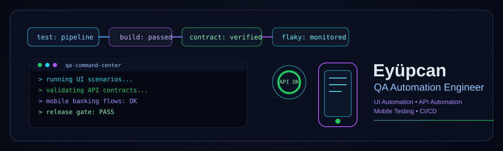
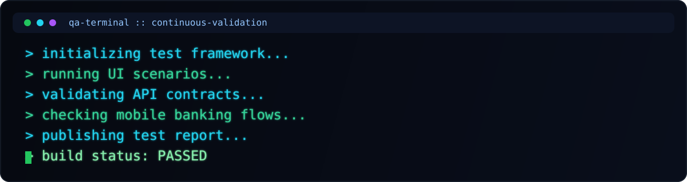

  

  QA Automation Engineer focused on building reliable UI, API and mobile automation systems.

  
  
  
  
  
  
  
  
  
  
  
  

## QA Automation Command Center

  

I design and scale automation systems that give teams fast, trustworthy feedback for every release cycle.

- Domain: mobile banking quality assurance and enterprise-grade test strategy
- Mission: reduce release risk while accelerating CI/CD delivery confidence
- Direction: SDET / Senior QA Automation Engineer with architecture ownership

## What I test

- **Mobile Banking:** critical account flows, transaction reliability, edge-case scenarios
- **UI Automation:** stable end-to-end validations with maintainable page/object architecture
- **API Automation:** contract-first checks, schema drift detection, and data integrity
- **Regression Systems:** deterministic suites tuned for high signal and low execution noise

## Automation mindset

- Treat tests as production software: readable, versioned, reviewable, observable
- Build layered pipelines: smoke, API, UI, mobile, contract checks with clear gates
- Optimize for reliability first, speed second, then scale both with CI parallelization
- Continuously attack flaky tests with root-cause analysis and hardening patterns

## Quality signals I care about

- Build pass trend and failure clustering
- Flaky test rate and quarantine escape rate
- Contract break detection lead time
- Time-to-feedback in pull request pipelines
- Defect leakage from pre-prod to production

## Current focus

- Mobile banking test automation maturity
- Contract testing across service boundaries
- Resilient UI/API suites for faster release validation
- CI/CD execution architecture and failure observability

## Featured automation projects

These links point to **your public repositories** under [`eyupcanbilgin`](https://github.com/eyupcanbilgin) (not placeholders). The six boxes at the top of your GitHub profile are **Pinned repositories** — you change those on your profile with **Customize pins**.

- [`playwright-quality-gates-lab`](https://github.com/eyupcanbilgin/playwright-quality-gates-lab) — Playwright + TypeScript QA lab (UI, API, a11y, performance smoke, CI gates)
- [`qa-event-performance-lab`](https://github.com/eyupcanbilgin/qa-event-performance-lab) — REST, Redis, RabbitMQ, Kafka/Redpanda, k6 / JMeter / Locust
- [`ai-quality-evaluation-lab`](https://github.com/eyupcanbilgin/ai-quality-evaluation-lab) — AI quality evaluation, regression datasets, groundedness / hallucination checks, CI thresholds

## Live engineering metrics

  
  
  
  
  

---

  Open to impactful QA automation collaborations and engineering leadership opportunities.

